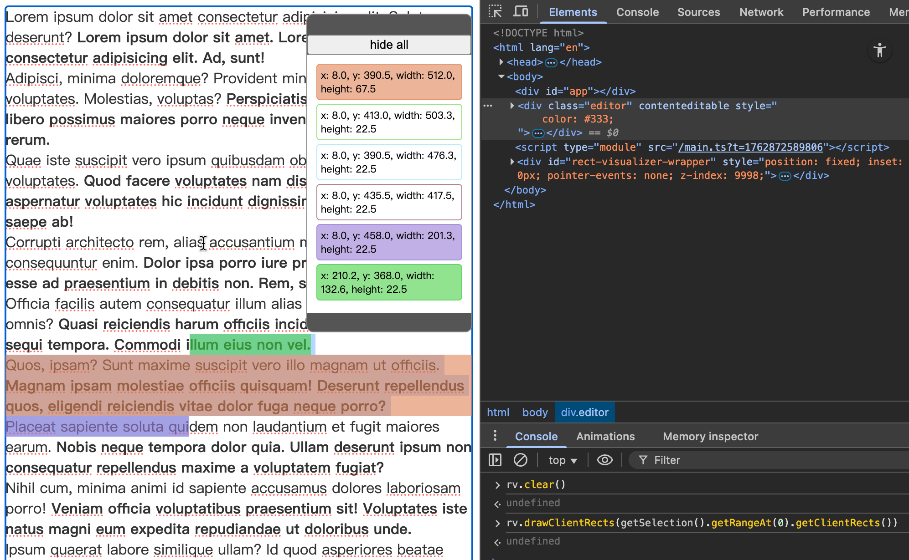
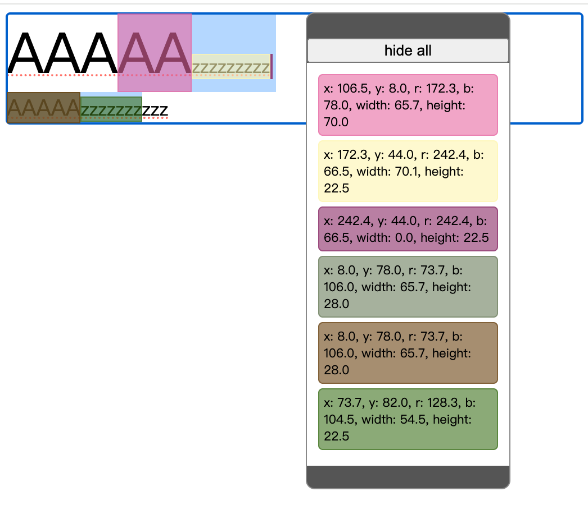

# rect-visualizer

A development tool for visualizing `DOMRect` rectangles.


## Showcase



## Install

```bash
npm install -D rect-visualizer
```

## Usage

```javascript
// while you import rect-visualizer, it will be assigned to window.rv
import rv from "rect-visualizer";

// you may get rects by Range.getClientRects while you have a selection
const rects = getSelection().getRangeAt(0)?.getClientRects() ?? [];
// draw rects, with 1px solid border to avoid invisible when width or height is 0
rv.drawClientRects(rects, {
  // alpha: 0.6,
  // clear: true,
  // colors: ["red", "green", "blue"],
});
// or append a single rect (which can with a name).
rv.drawClientRect(someRect, {name: "SomeRect", color: "#239923aa"})
// clear all rects
rv.clear();
```

## Features
- click the item to toggle the visibility.
- double-click the item to remove it.
- drag at the top or bottom of the hover hub to move it.

